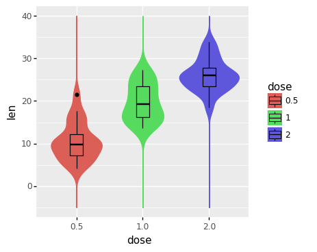
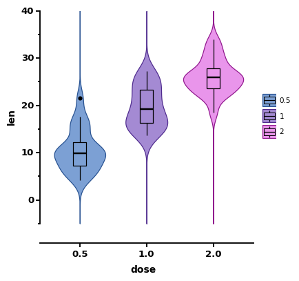
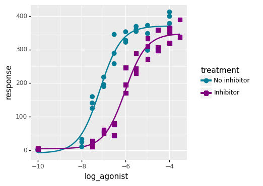
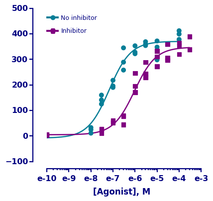

# plotnine-prism

Prism themes for [plotnine][1], inspired by [ggprism][2].


## Installation

```
pip install -U plotnine-prism
```

## Documentation

[https://pwwang.github.io/plotnine-prism][3]

## Usage

See [this notebook][6] for the following example, and also [Getting started][4] for a quick overview of `plotnine_prism` features.

```python
from plotnine import *
from plotnine_prism import *

from datar.all import f, as_categorical, mutate
from datar.datasets import ToothGrowth

ToothGrowth >>= mutate(dose=as_categorical(f.dose))

base = (
    ggplot(ToothGrowth, aes(x = "dose", y = "len")) +
    geom_violin(aes(colour = "dose", fill = "dose"), trim = False) +
    geom_boxplot(aes(fill = "dose"), width = 0.2, colour = "black")
)

p1 = base + ylim(-5, 40)
p2 = (
    base +
    scale_y_continuous(limits=[-5, 40], guide=guide_prism_offset_minor()) +
    scale_color_prism('floral') +
    scale_fill_prism('floral') +
    theme_prism()
)
# See examples/nb_helpers.py for plot_grid function
# plot_grid(p1, p2)
```

<table>
    <tr>
        <td valign="top"></td>
        <td valign="top"></td>
    </tr>
</table>

## More examples

The Dose Response Curve was recreated. See [this vignette][5] for the source code and step-by-step instructions.


<table>
    <tr>
        <td valign="top"></td>
        <td valign="top"></td>
    </tr>
</table>

[1]: https://github.com/has2k1/plotnine
[2]: https://github.com/csdaw/ggprism/
[3]: https://pwwang.github.io/plotnine-prism
[4]: https://pwwang.github.io/plotnine-prism/get_started
[5]: https://pwwang.github.io/plotnine-prism/raw/ex1-dose
[6]: https://pwwang.github.io/plotnine-prism/raw/README

